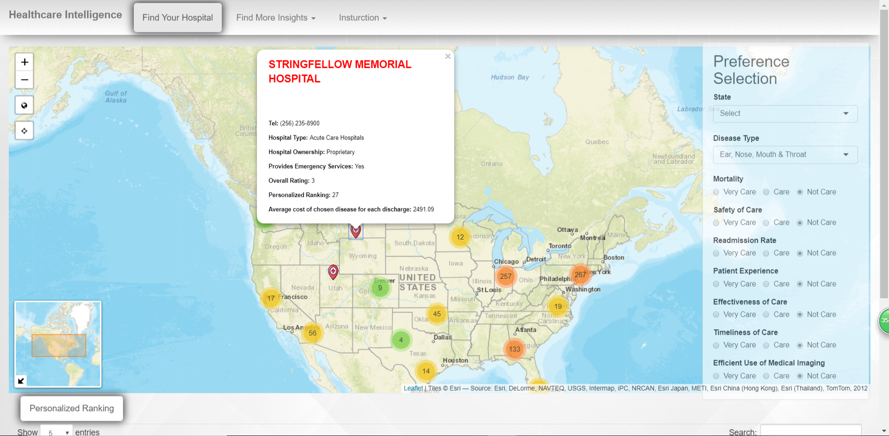

# Project 2: Healthcare Intelligence: Interactive Hospital Recommendation App 




+ **App link**: [https://grandeur-wang.shinyapps.io/healthcare_intelligence/]( https://grandeur-wang.shinyapps.io/healthcare_intelligence/)


### Team members (Group 12):
+ team leader  Wang, Guanren (gw2380@columbia.edu)
+ team member  Zhong, Ming (mz2692@columbia.edu)
+ team member  Cai, Zongbo (zc2455@columbia.edu)
+ team member  Li, Jingyue (jl5283@columbia.edu)


### Project summary: 
Since ancient times, people have faced the problem of being old and sick. Hospitals play a very important role in this matter. However, some hospitals are good at surgery, and some hospitals are good at internal medicine. Therefore, how to choose a hospital suitable for patients becomes a key issue. To solve this problem, we combined developed an app that allows patients to search for hospitals based on their type of illness and the needs of the hospital. More specificly, the hospitals are determined by the patient's preference to mortality, safety of care, readmission rate, patient experience, effectiveness of care, timeliness of care and efficient use of medical imaging, and their type of disease. Plus, we also consider price as one of the important factors for patients to choose a hospital, so we estimated cost of medical (average insurance coverage), in different states. In view of patients' inclination to nearby hospitals or adjacent state, we designed locate button and visualized the average cost for each category of disease in every state and average cost for each type of ownership in each state, helping users to make more informed decision.

### [Data Source](https://data.cms.gov/Medicare-Inpatient/Inpatient-Prospective-Payment-System-IPPS-Provider/97k6-zzx3)
The data is from government, please click the link above to get more information.

### Contribution statement:
Guanren Wang was responsible for the data cleaning required for the "Find Your Hospital" section, implementing personalized ranking calculation at backend, connecting data table to server and all functionality of interactive map. Plus, Guanren also did some fine-tuning of UI. Ming Zhong was responsible for the development of the UI. He later joined Guanren Wang to do some development in "Find Your Hospital" section. They also collaborated on completing the data table below the map. Zongbo Cai and Jingyue Li collaborated on data cleaning in the "Hospital Statistics" section. Zongbo Cai implemented three maps in the "Hospital Statistics" section. Jingyue Li converted the the first map from static to interactive.

Following [suggestions](http://nicercode.github.io/blog/2013-04-05-projects/) by [RICH FITZJOHN](http://nicercode.github.io/about/#Team) (@richfitz). This folder is orgarnized as follows.

```
proj/
├── app/
├── lib/
├── data/
├── doc/
└── output/
```

Please see each subfolder for a README file.

